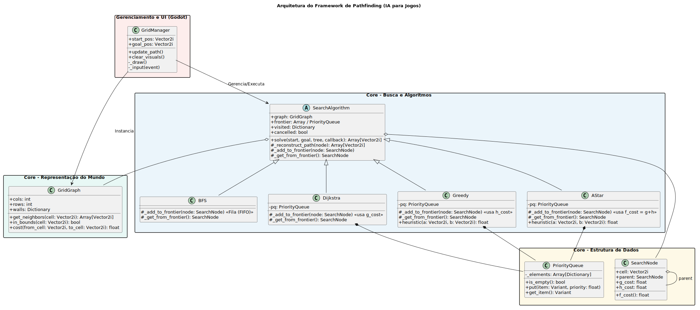
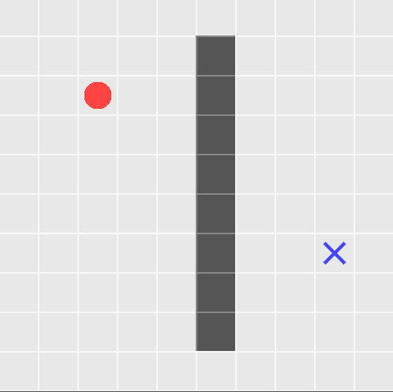
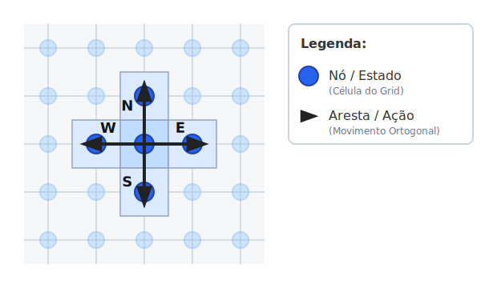

# Um Framework Didático para estudar Pathfinding (Godot 4)

Bem-vindo ao framework base para exploração de Algoritmos de Busca em Espaço de Estados. Este projeto foi desenhado para separar completamente a visualização (o mapa), a modelagem matemática (o grafo) e o "raciocínio" da Inteligência Artificial (a busca). 

Siga este guia para entender a arquitetura do projeto e como os conceitos teóricos se aplicam no código.

## Índice
- [Um Framework Didático para estudar Pathfinding (Godot 4)](#um-framework-didático-para-estudar-pathfinding-godot-4)
  - [Índice](#índice)
  - [Visão Geral da Arquitetura](#visão-geral-da-arquitetura)
    - [1. Core - Representação do Mundo](#1-core---representação-do-mundo)
    - [2. Core - Estrutura de Dados](#2-core---estrutura-de-dados)
    - [3. Core - Busca e Algoritmos (A Inteligência)](#3-core---busca-e-algoritmos-a-inteligência)
    - [4. Gerenciamento e UI (Godot)](#4-gerenciamento-e-ui-godot)
  - [1. O Ambiente Visual: `GridManager.gd`](#1-o-ambiente-visual-gridmanagergd)
    - [Como Funciona:](#como-funciona)
    - [O Ciclo de Animação:](#o-ciclo-de-animação)
  - [2. A Matemática do Mapa: `GridGraph.gd`](#2-a-matemática-do-mapa-gridgraphgd)
    - [A Teoria](#a-teoria)
    - [A Implementação](#a-implementação)
  - [3. A Abstração da Busca: `SearchNode` e `SearchAlgorithm`](#3-a-abstração-da-busca-searchnode-e-searchalgorithm)
    - [O Contêiner de Dados: `SearchNode`](#o-contêiner-de-dados-searchnode)
    - [O Motor da Busca: `SearchAlgorithm`](#o-motor-da-busca-searchalgorithm)
  - [4. Implementação Prática: Busca em Largura (BFS)](#4-implementação-prática-busca-em-largura-bfs)
    - [A Teoria do BFS](#a-teoria-do-bfs)
    - [A Estrutura de Dados](#a-estrutura-de-dados)
  - [5. O Desafio da Ordenação: A Fila de Prioridade (`PriorityQueue.gd`)](#5-o-desafio-da-ordenação-a-fila-de-prioridade-priorityqueuegd)
  - [6. Buscas com Custo e Heurística (Dijkstra, Greedy e A\*)](#6-buscas-com-custo-e-heurística-dijkstra-greedy-e-a)
    - [Dijkstra (Algoritmo de Custo Uniforme)](#dijkstra-algoritmo-de-custo-uniforme)
    - [Busca Gulosa (Greedy Best-First Search)](#busca-gulosa-greedy-best-first-search)
    - [A\* (A-Star)](#a-a-star)

---

## Visão Geral da Arquitetura

Para garantir boas práticas de Engenharia de Software aplicadas a Jogos Digitais, nosso framework está dividido em módulos lógicos. Essa separação garante que a inteligência do agente não fique "suja" com códigos de desenho na tela, e que o mapa possa ser facilmente trocado sem alterar os algoritmos.



A arquitetura está dividida em quatro pilares principais:

### 1. Core - Representação do Mundo
* **`GridGraph`**: Representa a matemática do cenário. Ele não sabe o que é um desenho, apenas conhece os limites (linhas/colunas), onde estão as colisões (`walls`) e os custos de movimentação. É ele quem responde à pergunta: *"Quais são os meus vizinhos válidos?"*.

### 2. Core - Estrutura de Dados
* **`SearchNode`**: A "migalha de pão". Guarda a posição atual, os custos ($G$ e $H$) e, crucialmente, uma referência ao nó "pai" para podermos reconstruir o caminho de volta.
* **`PriorityQueue`**: Uma estrutura otimizada que garante que os algoritmos de IA sempre avaliem primeiro os caminhos mais baratos e promissores.

### 3. Core - Busca e Algoritmos (A Inteligência)
* **`SearchAlgorithm`**: A classe base abstrata. Contém o "motor" principal da busca (o laço `while`).

* **`BFS` (Busca em Largura)**: Expande a fronteira igualmente para todos os lados usando uma Fila simples (FIFO).

* **`Dijkstra`**: Evolução do BFS. Usa a Fila de Prioridade baseada no custo real ($G$) - _cost so far_ - para encontrar caminhos mais baratos.

* **`Greedy` (Busca Gulosa)**: Usa a Fila de Prioridade baseada na estimativa até o alvo ($H$) para ser extremamente rápido.

* **`AStar` (A*)**: O estado da arte. Une custo e estimativa ($F = G + H$) para encontrar o caminho perfeito de forma eficiente.

### 4. Gerenciamento e UI (Godot)
* **`GridManager`**: O "maestro" visual. Ele gerencia o input do mouse (para desenhar paredes e colocar o alvo), pinta a tela e executa a animação passo a passo da nossa IA em ação.

---

## 1. O Ambiente Visual: `GridManager.gd`

Para entendermos a Inteligência Artificial em jogos, precisamos distinguir o **Mapa** (onde o agente pode ir) do **Raciocínio** (como o agente decide para onde ir).

A classe `GridManager` atua como o nosso "tabuleiro". Ela não toma decisões inteligentes; sua única responsabilidade é desenhar a interface gráfica, capturar os seus cliques (usuário) e gerenciar o estado visual (paredes, ponto inicial, objetivo e caminho).

### Como Funciona:
Muitos jogos usam mapas baseados em tiles (grids). Um grid é, matematicamente, um grafo regular onde cada célula é um nó e as células adjacentes são conectadas por arestas. Esta abstração permite aplicar algoritmos de grafos em qualquer mapa de jogo.

No `GridManager`, representamos esse espaço visualmente usando a função `_draw()` nativa da Godot, iterando sobre as coordenadas `Vector2i` (coluna e linha). Os obstáculos são guardados em um Dicionário (`walls`), o que garante uma consulta extremamente rápida de colisões.



### O Ciclo de Animação:
O diferencial deste script é o uso de Corrotinas (`await`). Ao invés de exibir a solução instantaneamente, o `GridManager` pede ao algoritmo de busca que faça pequenas pausas a cada nó processado:

```gdscript
# Trecho de GridManager.gd
var result = await my_search.solve(start_pos, goal_pos, get_tree(), queue_redraw)
```

Isso permite que você visualize a **Fronteira** expandindo-se em tempo real na sua tela, facilitando a compreensão de como o computador "lê" o espaço.

---

## 2. A Matemática do Mapa: `GridGraph.gd`

O `GridGraph` é a ponte entre o desenho na tela e a teoria de grafos. Em IA, não visualizamos o grafo apenas como pontos em um papel, mas como um **Espaço de Estados**.

### A Teoria
Diferente de listas ligadas (sequenciais) ou árvores (hierárquicas), o grafo é a estrutura de dados baseada em nós mais flexível. Ele permite representar conexões complexas onde qualquer nó pode se conectar a qualquer outro, sem as restrições de “pai e filho” das árvores.

Nesta modelagem:
* **Vértice (Nó) = Estado:** Representa uma configuração específica do mundo. No nosso caso, é a coordenada (x, y) no grid.
* **Aresta = Ação (Operador):** Representa a transição entre estados. É o “movimento” permitido. Adicionalmente, arestas podem ter **Custos** (ex: andar na grama vs. andar na água).



### A Implementação
A abstração das conexões ocorre na função `get_neighbors()`. O algoritmo pergunta ao Grafo: *"Quais são os vizinhos válidos da célula atual?"*. O Grafo calcula os movimentos ortogonais e filtra aqueles que são obstáculos ou que estão fora dos limites da tela:

```gdscript
# Trecho de GridGraph.gd
func get_neighbors(cell: Vector2i) -> Array[Vector2i]:
	var neighbors: Array[Vector2i] = []
	var directions = [Vector2i.UP, Vector2i.RIGHT, Vector2i.DOWN, Vector2i.LEFT]

	for dir in directions:
		var next_cell = cell + dir
		# Filtra paredes e limites do mapa
		if in_bounds(next_cell) and not walls.has(next_cell):
			neighbors.append(next_cell)
			
	return neighbors
```

---

## 3. A Abstração da Busca: `SearchNode` e `SearchAlgorithm`

A busca é o algoritmo que “navega” por esse grafo. Ao iniciar a exploração, o algoritmo transforma o grafo em uma **Árvore de Busca**. 

### O Contêiner de Dados: `SearchNode`
Para navegar sem se perder, precisamos deixar um "rastro de migalhas". A classe `SearchNode` armazena a célula atual, quem é o seu "pai" (de onde viemos, essencial para o *backtracking*) e os custos associados a este caminho.

Para algoritmos informados (como o A*), o nó armazena os valores para a fórmula de avaliação:
$f(n) = g(n) + h(n)$
Onde $g(n)$ é o custo acumulado real do início até o nó atual, e $h(n)$ é a heurística (estimativa do nó até o objetivo).

### O Motor da Busca: `SearchAlgorithm`
Esta é uma **Classe Abstrata** (usando o padrão de projeto *Template Method*). Ela contém o laço principal de busca que é idêntico para todos os algoritmos.

Os componentes da exploração presentes no código são:
* **Fronteira (Open List):** A “lista de espera” com os nós descobertos, mas ainda não visitados.
* **Visitados (Closed List):** O Dicionário que garante que não entraremos em loop infinito.
* **Estratégia:** A regra que define quem sai da fronteira primeiro.

A classe base define os métodos `_add_to_frontier` e `_get_from_frontier` que **devem** ser obrigatoriamente implementados pelas classes filhas. 

---

## 4. Implementação Prática: Busca em Largura (BFS)

A **Busca em Largura** (BFS - *Breadth-First Search*) é o nosso primeiro algoritmo concreto. 

### A Teoria do BFS
Pertence à categoria de Busca Cega, pois explora o grafo sem conhecimento prévio da direção do objetivo. É como explorar um labirinto no escuro, expandindo como água escorrendo pelo chão.

* **Resultado:** Encontra sempre o caminho com o menor número de passos (arestas) em grafos *não-ponderados* (onde todo passo tem o mesmo custo).

> **[🖼️ INSERIR AQUI: Print da simulação rodando, mostrando a área azul claro de expansão do BFS espalhando-se em ondas a partir do ponto de início]**

### A Estrutura de Dados
O comportamento em "ondas" acontece porque o BFS utiliza uma **Fila (Queue - FIFO)** como estrutura de apoio. O primeiro nó a ser descoberto é o primeiro a ser explorado. Na Godot, usamos as funções de `Array`:

```gdscript
class_name BFS
extends SearchAlgorithm

# No BFS (Fila), quem chega entra no final da fila.
func _add_to_frontier(node: SearchNode):
	frontier.push_back(node)

# No BFS (Fila), quem é atendido é o PRIMEIRO que chegou (FIFO).
func _get_from_frontier() -> SearchNode:
	return frontier.pop_front()
```

---

## 5. O Desafio da Ordenação: A Fila de Prioridade (`PriorityQueue.gd`)

Quando começamos a considerar os **Custos** das arestas (ex: andar no asfalto é mais barato que na lama) ou a **Estimativa** até o objetivo (heurística), uma Fila comum (FIFO) não serve mais. Precisamos de uma **Fila de Prioridade**.

Na Fila de Prioridade, os nós não são processados na ordem de chegada, mas sim pelo seu **Custo de Avaliação (Prioridade)**. O nó com o menor custo deve ser sempre o próximo a sair.

O nosso framework fornece a classe `PriorityQueue.gd`. Ela atua como uma "caixa preta" que resolve a inserção ordenada (usando Busca Binária) de forma super otimizada para a Godot:

```gdscript
var pq = PriorityQueue.new()
pq.put(meu_no, meu_no.f_cost()) # Insere o nó com sua prioridade
var proximo_no = pq.get_item()  # Puxa sempre o que tem MENOR custo
```

---

## 6. Buscas com Custo e Heurística (Dijkstra, Greedy e A*)

Graças à abstração que construímos, alterar completamente a "inteligência" do agente exige apenas mudar os dois métodos da fronteira e escolher o que usaremos como prioridade!

### Dijkstra (Algoritmo de Custo Uniforme)
O Dijkstra é a evolução do BFS para grafos com custo. Em vez de uma Fila simples, ele usa a Fila de Prioridade ordenada pelo **Custo Real Acumulado ($g$)**.
* Ele ainda expande para todos os lados, mas dá preferência aos caminhos mais "baratos" (ex: contorna uma floresta densa se for mais rápido ir pelo asfalto longo).

### Busca Gulosa (Greedy Best-First Search)
A Busca Gulosa ignora o custo real que já foi gasto e olha apenas para a **Heurística ($h$)**, ou seja, a "distância em linha reta" até o objetivo.
* É extremamente rápida e vai "direto" para o alvo, mas costuma errar e fazer caminhos não-ótimos quando encontra obstáculos grandes (paredes côncavas).

### A* (A-Star)
O A* une o melhor dos dois mundos. Ele usa a Fila de Prioridade ordenada pela soma dos dois fatores: **Custo Real + Estimativa**.
$f(n) = g(n) + h(n)$
* Se a heurística for *admissível* (nunca superestimar a distância real), o A* é matematicamente garantido de encontrar o caminho ótimo, sendo muito mais eficiente e rápido que o Dijkstra.

> **[🖼️ INSERIR AQUI: Print comparativo entre o A* e o Dijkstra no mesmo mapa, mostrando como o A* explora muito menos células desnecessárias]**